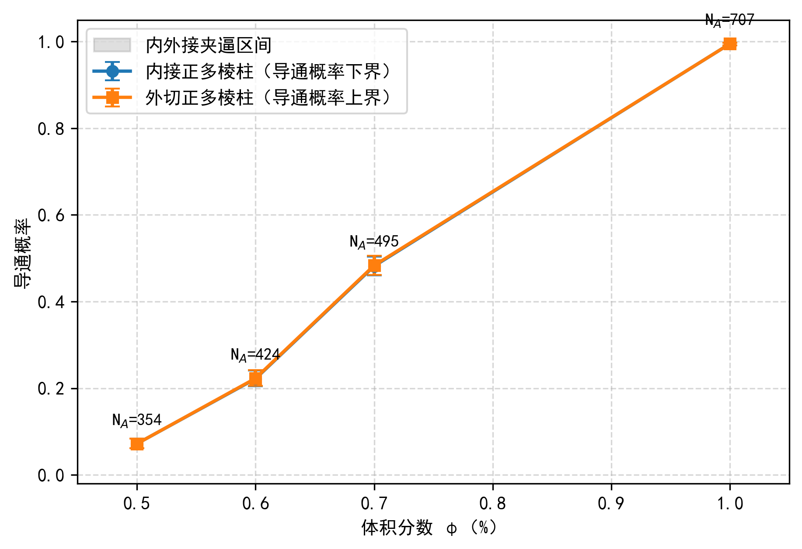
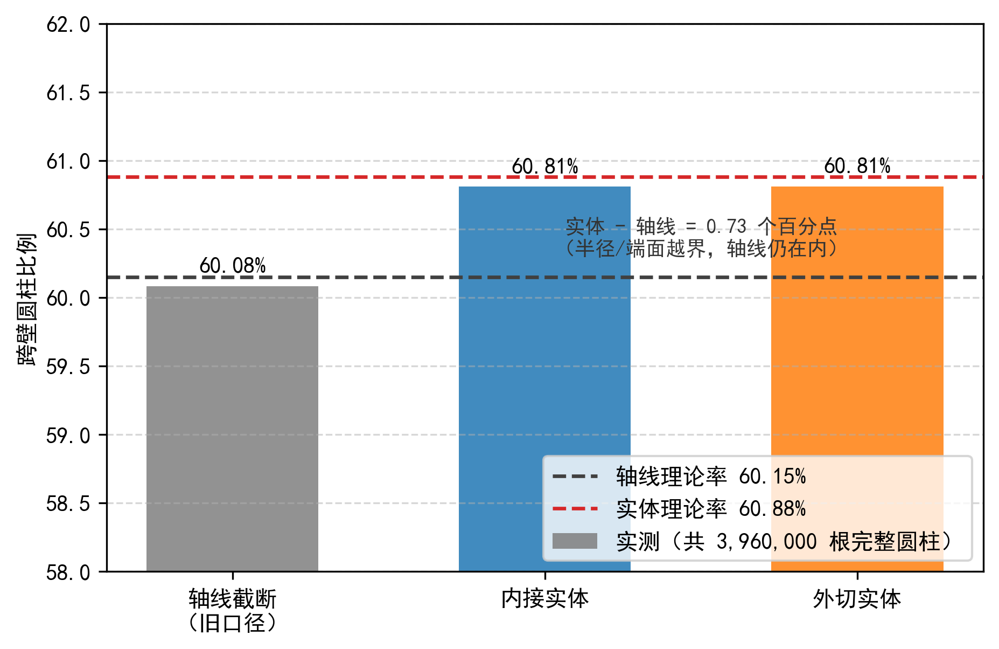

# 问题2报告（完整实体正式运行版）

> 成文日期：2026-08-09

## 一、问题分析

本问研究介质 A 填充量对微构体导通概率的影响。微构体为边长
\(L=10000\,\mathrm{nm}\) 的立方体，中心位于坐标原点，仅垂直于
\(X\) 轴的左右两个表面带电，其余四面绝缘。介质 A 为长度
\(l_A=5000\,\mathrm{nm}\)、底面半径 \(r_A=30\,\mathrm{nm}\) 的有限平端圆柱。

题目给定介质 A 的四个体积分数

\[
0.50\%,\qquad 0.60\%,\qquad 0.70\%,\qquad 1.00\%,
\]

要求分别估计微构体的导通概率。单个随机微构体只有“导通”和“不导通”两种状态，因此采用蒙特卡洛方法生成大量相互独立的随机构型，以样本导通频率估计导通概率，并使用 95% Wilson 区间描述抽样误差。

本报告的核心改进是将介质 A 按完整圆柱实体处理。真实圆柱分别由横截面内接、外切正多边形形成的正多棱柱逼近，从而得到导通概率的几何下界和上界。该方法同时处理圆柱侧面越界、端面接触、多方向周期平移和片段间最短表面距离，避免仅截断轴线造成的边界漏判。

## 二、模型假设

1. 微构体区域为 \(\Omega=[-5000,5000]^3\)，左右带电面分别为
   \(\Gamma_L:x=-5000\) 和 \(\Gamma_R:x=5000\)。
2. 介质 A 为有限平端圆柱，长度和半径分别为 5000 nm、30 nm。
3. 圆柱中心在微构体内均匀分布，方向服从三维各向同性分布。
4. 介质位置生成后不再移动，不考虑重力与碰撞，允许介质相互重叠或贯穿。
5. 两介质实体之间，或介质与带电面之间的最短表面距离不超过
   \(\delta=1.8\,\mathrm{nm}\) 时视为电接触。
6. 介质越界部分按照题目给定规则平移一个微构体边长，从相对侧重新进入；实现上等价为周期平移副本与基本盒的实体裁剪。
7. 同一完整圆柱截断产生的多个片段共享来源编号，但不因同源关系自动建立电连接，各片段只按照平移后的实际位置参与接触判定。
8. 体积分数按截断前的完整圆柱体积计算，边界处理不改变介质数量及计量体积。
9. 四个体积分数分别进行 \(M=2000\) 次独立试验，随机种子固定并只由体积分数编号和试验编号决定，结果不受并行调度顺序影响。

> **核心口径**
>
> 本报告以“完整实体周期裁剪、同源片段不自动连接”为统一口径。若改为同源片段无条件电连续，导通网络的物理含义将改变，本文结果不再适用。

## 三、模型建立

### 3.1 介质数量与随机生成

单根介质 A 和微构体的体积分别为

\[
V_A=\pi r_A^2l_A,
\qquad
V_0=L^3.
\tag{1}
\]

给定体积分数 \(\phi\) 时，完整介质数量取

\[
N_A=\operatorname{Round}_{\mathrm{half\ up}}
\left(\frac{\phi V_0}{V_A}\right).
\tag{2}
\]

四个体积分数对应的介质数量为

| 体积分数 | 介质数量 \(N_A\) |
|---:|---:|
| \(0.50\%\) | 354 |
| \(0.60\%\) | 424 |
| \(0.70\%\) | 495 |
| \(1.00\%\) | 707 |

对第 \(i\) 根圆柱，中心取

\[
\boldsymbol c_i\sim U([-L/2,L/2]^3).
\tag{3}
\]

令 \(z_i\sim U(-1,1)\)、\(\theta_i\sim U(0,2\pi)\)，则各向同性方向向量为

\[
\boldsymbol u_i=
\left(
\sqrt{1-z_i^2}\cos\theta_i,
\sqrt{1-z_i^2}\sin\theta_i,
z_i
\right).
\tag{4}
\]

圆柱轴线两端点为

\[
\boldsymbol p_i^{(1)}=\boldsymbol c_i-\frac{l_A}{2}\boldsymbol u_i,
\qquad
\boldsymbol p_i^{(2)}=\boldsymbol c_i+\frac{l_A}{2}\boldsymbol u_i.
\tag{5}
\]

### 3.2 完整实体夹逼

真实圆柱横截面不是多边形，直接进行盒裁剪和凸多面体距离计算较困难。为此，用正 \(K\) 边形构造内接、外切正多棱柱

\[
\mathcal P_i^-\subseteq C_i\subseteq\mathcal P_i^+,
\tag{6}
\]

其中 \(C_i\) 表示真实圆柱。内接多边形顶点半径为 \(r_A\)，外切多边形顶点半径为

\[
r_A^+=r_A\sec\left(\frac{\pi}{K}\right).
\tag{7}
\]

正多边形相对真实圆的最大单侧径向误差为

\[
\varepsilon(K)=\max\left\{
r_A\left(1-\cos\frac{\pi}{K}\right),
r_A\left(\sec\frac{\pi}{K}-1\right)
\right\}.
\tag{8}
\]

正式计算取 \(K=64\)，得到

\[
\varepsilon(64)\approx0.0362\,\mathrm{nm},
\]

约为接触阈值 1.8 nm 的 2.0%。外切实体更容易建立接触，内接实体更难建立接触，因此对固定体积分数的真实圆柱导通概率有

\[
P_{\mathrm{inner}}(\phi)
\le P_{\mathrm{exact}}(\phi)
\le P_{\mathrm{outer}}(\phi).
\tag{9}
\]

### 3.3 周期边界与实体裁剪

对完整多棱柱 \(\mathcal P_i\)，枚举可能与基本盒相交的周期平移副本，并与微构体区域逐面裁剪：

\[
F_{i,\boldsymbol k}
=\left(\mathcal P_i+L\boldsymbol k\right)\cap\Omega,
\qquad
\boldsymbol k\in\{-1,0,1\}^3.
\tag{10}
\]

仅保留非空交集。多方向同时越界时，平移向量取各坐标轴候选平移的笛卡尔积，从而保留组合周期镜像。裁剪后得到的每个凸多面体片段作为独立几何节点参与接触判定。

### 3.4 接触网络与导通判定

将全部实体片段作为图节点，并增加左右电极节点 \(S,T\)。

- 若片段到左电极面的距离不超过 \(\delta\)，连接 \(S\)；
- 若片段到右电极面的距离不超过 \(\delta\)，连接 \(T\)；
- 若两个片段的最短表面距离不超过 \(\delta\)，在二者之间建立连接边。

片段间距离采用凸多面体 GJK 算法计算。为降低计算量，先使用扩张轴对齐包围盒排除明显分离的片段对，再以轴线距离下界进行安全筛选，仅对剩余候选调用 GJK 精算。

采用并查集维护网络连通性。当 \(S\) 与 \(T\) 属于同一连通分量时，判定该随机微构体导通。

### 3.5 蒙特卡洛概率估计

对固定体积分数 \(\phi\)，设第 \(s\) 个随机微构体的导通状态为

\[
Y_s(\phi)=
\begin{cases}
1,&\text{微构体导通},\\
0,&\text{微构体不导通}.
\end{cases}
\tag{11}
\]

导通概率估计为

\[
\widehat P(\phi)=\frac{1}{M}\sum_{s=1}^{M}Y_s(\phi),
\qquad M=2000.
\tag{12}
\]

对内接和外切实体使用完全相同的随机构型，形成共同样本。这样两者的差异主要反映几何离散误差，而不是两组独立蒙特卡洛样本的随机波动。

采用 95% Wilson 置信区间

\[
\frac{
\widehat P+\dfrac{z^2}{2M}
\pm z\sqrt{\dfrac{\widehat P(1-\widehat P)}{M}
+\dfrac{z^2}{4M^2}}
}{1+\dfrac{z^2}{M}},
\qquad z=1.959964.
\tag{13}
\]

### 3.6 参数与计算设置

| 参数 | 数值 | 依据 |
|---|---:|---|
| 微构体边长 \(L\) | 10000 nm | 题目明示 |
| 介质 A 长度 \(l_A\) | 5000 nm | 题目明示 |
| 介质 A 半径 \(r_A\) | 30 nm | 题目明示 |
| 接触阈值 \(\delta\) | 1.8 nm | 题目明示 |
| 横截面边数 \(K\) | 64 | 建模抉择，径向误差约 0.0362 nm |
| 每个体积分数试验数 \(M\) | 2000 | 建模抉择 |
| 体积分数点数 | 4 | 题目明示 |
| 总随机构型数 | 8000 | \(4\times2000\) |
| 并行进程数 | 16 | 计算设置 |
| 基础随机种子 | 20260808 | 可复现性设置 |
| 检查点间隔 | 20 个样本 | 运行可靠性设置 |

正式任务采用检查点与断点续跑。每完成 20 个随机构型即原子写入检查点；恢复时只有体积分数、试验数、边数和随机种子完全一致才继续使用已有样本。本次最终检查点为 8000/8000，状态为完成。

## 四、结果与分析

### 4.1 完整实体正式结果

内接、外切实体在相同的 2000 个共同随机样本上计算，结果如下。

| 体积分数 | \(N_A\) | 内接导通数 | 内接概率及 95% Wilson 区间 | 外切导通数 | 外切概率及 95% Wilson 区间 | 几何点估计夹逼 |
|---:|---:|---:|---:|---:|---:|---:|
| 0.50% | 354 | 144 | 0.0720，[0.0615, 0.0842] | 144 | 0.0720，[0.0615, 0.0842] | [0.0720, 0.0720] |
| 0.60% | 424 | 444 | 0.2220，[0.2043, 0.2407] | 446 | 0.2230，[0.2053, 0.2418] | [0.2220, 0.2230] |
| 0.70% | 495 | 964 | 0.4820，[0.4602, 0.5039] | 967 | 0.4835，[0.4617, 0.5054] | [0.4820, 0.4835] |
| 1.00% | 707 | 1990 | 0.9950，[0.9908, 0.9973] | 1990 | 0.9950，[0.9908, 0.9973] | [0.9950, 0.9950] |

因此，真实圆柱模型的导通概率点估计被夹逼为

\[
\boxed{
\begin{aligned}
P(0.50\%)&=0.0720,\\
P(0.60\%)&\in[0.2220,0.2230],\\
P(0.70\%)&\in[0.4820,0.4835],\\
P(1.00\%)&=0.9950.
\end{aligned}}
\tag{14}
\]

其中等号表示在本次 64 边内外接共同样本中两模型结果一致，并不表示不存在蒙特卡洛抽样误差；相应统计不确定性仍应以 Wilson 区间为准。

### 4.2 变化规律

导通概率随体积分数增加而显著上升：

1. 体积分数为 0.50% 时，导通概率约为 7.2%，体系大多仍由不贯通的局部连通簇组成；
2. 体积分数增至 0.60% 时，导通概率约为 22.2%~22.3%；
3. 体积分数增至 0.70% 时，导通概率上升至约 48.2%~48.35%，已经接近 50%；
4. 体积分数达到 1.00% 时，导通概率约为 99.5%，绝大多数随机构型已经贯通。

这说明考察区间覆盖了明显的渗流过渡过程。问题 3 得到的 90% 临界体积分数约 0.87%，位于 0.70% 与 1.00% 之间，与本问概率变化趋势一致。

> 图 4 介质A体积分数与导通概率的 64 边内外接夹逼。蓝线为内接正多棱柱（导通概率下界），橙线为外切正多棱柱（上界），灰色带为夹逼区间，误差棒为 95% Wilson 区间，各点标注介质数量 \(N_A\)。8000 个共同样本中夹逼违例 0 个、内外接判定不同仅 5 个；曲线呈 S 形渗流过渡，90% 导通线位于 0.70% 与 1.00% 之间。

### 4.3 几何夹逼精度

四个体积分数共 8000 组共同样本中：

- 内接模型导通而外切模型不导通的夹逼违例为 0；
- 内外接导通结论不同的样本仅 5 个，占 0.0625%；
- 0.60% 处概率夹逼宽度为 0.0010；
- 0.70% 处概率夹逼宽度为 0.0015；
- 0.50% 和 1.00% 处两模型点估计完全一致。

因此，在当前四个体积分数和 \(K=64\) 设置下，圆柱多边形离散造成的几何不确定性明显小于蒙特卡洛抽样区间宽度。真实圆柱概率虽不能由单一多棱柱模型精确给出，但已经被限制在很窄的区间内。

### 4.4 与轴线边界近似的对照

为量化旧轴线边界近似的影响，同一批随机构型还运行了轴线模型。

| 体积分数 | 轴线模型导通数 | 内接实体导通数 | 外切实体导通数 | 轴线/内接样本级分歧 | 轴线/外切样本级分歧 |
|---:|---:|---:|---:|---:|---:|
| 0.50% | 146 | 144 | 144 | 6 | 6 |
| 0.60% | 449 | 444 | 446 | 17 | 19 |
| 0.70% | 972 | 964 | 967 | 30 | 33 |
| 1.00% | 1989 | 1990 | 1990 | 3 | 3 |

轴线模型不是实体模型的严格上界或下界，净导通数接近并不意味着样本判定完全一致。例如 0.70% 处，轴线与外切实体的净导通数仅相差 5，但共有 33 个样本的导通结论不同，部分差异相互抵消。因此，轴线结果适合作为历史基线和程序诊断，不应继续作为本问最终概率。

### 4.5 跨壁比例诊断

正式运行共生成

\[
2000\times(354+424+495+707)=3,960,000
\]

根完整圆柱。轴线模型记录的跨壁圆柱约为 2,379,322 根，比例约 60.08%；64 边内接实体记录约 2,408,096 根，比例约 60.81%；外切实体记录约 2,408,128 根，比例同样约 60.81%。

实体口径比轴线口径多识别约 0.73 个百分点的跨壁圆柱，主要来自“轴线仍在盒内，但圆柱半径或端面已越过边界”的情况。该结果说明跨壁圆柱占多数并非判定过宽，而是长圆柱在边长仅为其长度两倍的盒内随机取向时自然产生的几何现象；判断实现是否异常，不能只看“是否超过 50%”，还应同时与实体投影和共同样本基准对照。

> 图 8 跨壁圆柱比例诊断。灰、蓝、橙柱分别为轴线截断、内接实体、外切实体在 396 万根完整圆柱上的实测跨壁比例（60.08%、60.81%、60.81%），虚线为百万样本单圆柱投影理论率（轴线 60.15%、实体 60.88%）；实体比轴线多识别约 0.73 个百分点，恰为理论径向越界率，验证实体实现。

## 五、模型检验

### 5.1 单元与构造性测试

Q2 新代码共 44 项单元测试全部通过，覆盖：

1. 内部圆柱、单面跨壁、两面跨壁、多方向平移以及仅半径跨壁情形；
2. 圆柱投影半宽、周期裁剪片段数量和全部顶点盒内约束；
3. 表面间距恰等于、略小于和略大于 1.8 nm 的接触阈值样本；
4. 平行、相交和随机有限圆柱的距离判定；
5. 左右电极接触、断链与构造性导通链；
6. 同源跨壁片段不自动短接左右电极；
7. 内接导通事件包含于外切导通事件的夹逼关系；
8. 固定随机种子的可复现性、介质数量舍入和 Wilson 区间。

### 5.2 全量约束检查

- [x] 四个体积分数均为 2000 次试验，总样本数 8000；
- [x] 正多边形边数为 64，最大径向误差约 0.0362 nm；
- [x] 内外接模型使用相同随机构型；
- [x] 8000 个样本中实体夹逼违例为 0；
- [x] 内外接判定不同的样本仅 5 个；
- [x] 检查点最终状态为 complete，样本计数 8000/8000；
- [x] 随机种子和试验编号映射固定，结果可复现。

### 5.3 统计误差与适用范围

每个体积分数取 \(M=2000\) 时，概率接近 0.5 的 0.70% 组 Wilson 区间最宽，内接模型区间约为 [0.4602, 0.5039]；概率接近 1 的 1.00% 组区间明显更窄。报告概率时应保留置信区间，不能将点估计的四位小数理解为同等精度的真实概率。

以下因素改变时需要重新计算：同源片段的电学口径、接触阈值、位置或方向分布、圆柱长度和半径，以及允许碰撞或禁止重叠等物理假设。

> **待验证**
>
> - 使用另一组独立主种子复算四个体积分数，检查点估计的跨种子稳定性；
> - 对接触阈值 1.5~2.0 nm 进行逐点敏感性扫描；
> - 对方向偏好、空间聚集等非均匀分布进行敏感性分析；
> - 若论文最终需要报告计算耗时，应重新进行不中断计时。本次任务采用断点续跑，结果文件中的 `wall_elapsed_s` 仅记录最后一次续跑阶段，不代表完整累计壁钟时间。

## 六、与旧报告的区别

| 项目 | 旧报告 | 本报告 |
|---|---|---|
| 正式概率来源 | 轴线边界模型 \(M=2000\) | 64 边完整实体夹逼，每点 \(M=2000\) |
| 实体模型作用 | 每点 20 次小样本校核 | 8000 次正式主计算 |
| 边界几何 | 轴线切分为主 | 完整实体周期裁剪 |
| 结果表达 | 单一概率值 | 真实圆柱概率的内外接夹逼区间 |
| 几何误差 | 仅定性讨论 | 最大径向误差 0.0362 nm，实测夹逼样本 5/8000 |
| 跨壁诊断 | 小样本或独立诊断 | 396 万根正式样本，实体跨壁约 60.81% |
| 运行可靠性 | 一次性运行 | 每 20 个样本检查点保存，可断点续跑 |

旧报告中的轴线概率 0.0905、0.2170、0.4680、0.9945 不再作为最终答案。其随机样本与本次实体正式运行也不完全相同，不能只用两组点估计的差值解释为纯几何误差；几何影响应以本次同一批共同样本的轴线/实体对照为准。

## 七、结论

在“介质 A 为有限平端圆柱、中心均匀、方向各向同性、允许重叠、周期边界截断后同源片段不自动连接、表面距离不超过 1.8 nm 视为接触、圆柱实体由 64 边内接/外切正多棱柱夹逼”的模型口径下，对每个体积分数进行 2000 次独立蒙特卡洛试验，得到：

\[
\boxed{
\begin{array}{c|c}
\text{介质 A 体积分数} & \text{导通概率点估计夹逼}\\ \hline
0.50\% & 0.0720\\
0.60\% & [0.2220,0.2230]\\
0.70\% & [0.4820,0.4835]\\
1.00\% & 0.9950
\end{array}}
\]

8000 个共同样本中没有出现实体上下界违例，内外接判定不同的样本仅 5 个，说明 64 边实体离散造成的几何不确定性很小。随着介质 A 体积分数由 0.50% 增至 1.00%，微构体导通概率由约 7.2% 快速上升至约 99.5%，呈现明显的渗流过渡特征。

本报告的正式答案以完整实体夹逼结果为准；轴线模型仅作为历史基线和同样本诊断，不再作为最终概率来源。
